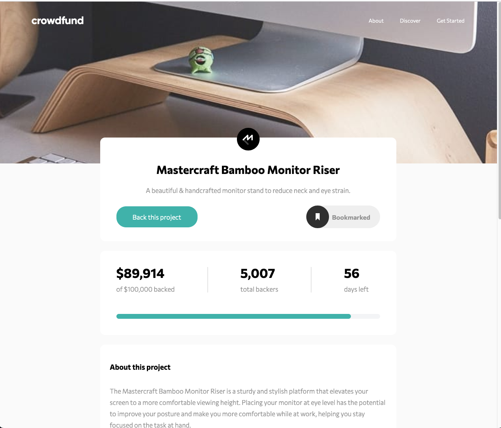

# Frontend Mentor - Crowdfunding product page solution

This is a solution to the [Crowdfunding product page challenge on Frontend Mentor](https://www.frontendmentor.io/challenges/crowdfunding-product-page-7uvcZe7ZR).

## Table of contents

-  [Overview](#overview)
   -  [The challenge](#the-challenge)
   -  [Screenshot](#screenshot)
   -  [Links](#links)
-  [My process](#my-process)
   -  [Built with](#built-with)
   -  [What I learned](#what-i-learned)
   -  [Continued development](#continued-development)
-  [Author](#author)

## Overview

### Requirements

Users should be able to:

-  View the optimal layout depending on their device's screen size
-  See hover states for interactive elements
-  Make a selection of which pledge to make
-  See an updated progress bar and total money raised based on their pledge total after confirming a pledge
-  See the number of total backers increment by one after confirming a pledge
-  Toggle whether or not the product is bookmarked

### Screenshot

### Links

-  Solution URL: [Github Repo](https://github.com/jacksonwhiting/crowdfunding-product-page)
-  Live Site URL: [Live Site](https://jw-crowdfunding-product-page.netlify.app/)

## My process

### Built with

-  Semantic HTML5 markup
-  CSS custom properties
-  Flexbox
-  CSS Grid
-  Mobile-first workflow
-  Tailwind CSS
-  Vanilla Javascroipt

### What I learned

I'm ready to try a framework. The laborious process of working with the DOM in vanilla javascript is starting to wear on me. Not being able to smoothly break the project into components makes it difficult to manage.

### Continued development

I'm going to build my next site with Astro.js

## Author

-  Frontend Mentor - [@jacksonwhiting](https://www.frontendmentor.io/profile/jacksonwhiting)
-  Twitter - [@JWhiting00](https://www.twitter.com/JWhiting00)
